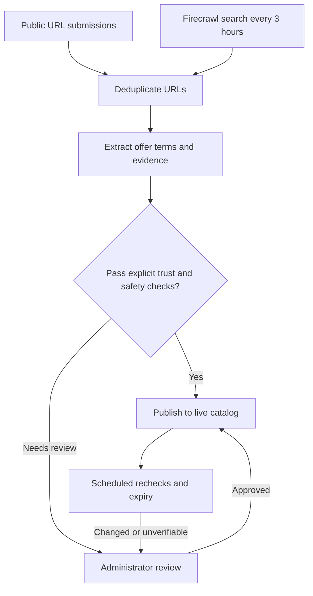

<p align="center"></p>
<h1 align="center">Perkdrop.click</h1>
<p align="center">Free tools, credits, and programs—with eligibility, evidence, and original links.</p>
<p align="center"><a href="https://perkdrop-click.sansynx.workers.dev">Visit Perkdrop</a></p>

## How it works



Four search categories feed the same intake pipeline. Repeated offer keys merge; uncertain terms and untrusted sources need review. Administrators can review up to 20 offers per batch. No domain is trusted by default, and production contains no demo listings.

Rechecks run in bounded batches every 12 hours. Changed or repeatedly unverifiable offers are hidden pending review; expired offers leave the catalog.

## Tech stack

| Layer              | Tools                                                   |
| ------------------ | ------------------------------------------------------- |
| Website            | React 19, TanStack Start, TypeScript, Vite              |
| UI                 | Geist, Phosphor icons, CSS, generated WebP hero         |
| Backend            | Convex database, live queries, cron jobs, workflows     |
| Discovery          | Firecrawl search and structured extraction              |
| Hosting and checks | Cloudflare Workers, Vitest, convex-test, GitHub Actions |

Provider favicons use the offer's HTTPS origin, with initials as fallback. Icons do not establish trust.

## Run locally

Use Node 22.22.3+ and pnpm 11.21.0.

```sh
pnpm install --frozen-lockfile
pnpm exec convex dev
```

Set `VITE_CONVEX_URL` in an ignored `.env.local` following [.env.example](.env.example). In another terminal:

```sh
pnpm run dev
```

Set `FIRECRAWL_API_KEY` and `ADMIN_REVIEW_TOKEN` (at least 32 characters) in your **Convex deployment**, not the website Worker. Never prefix secrets with `VITE_` or commit them. The admin page holds its token only in memory; backend authorization protects administrative operations.

## Check and deploy

```sh
pnpm run check
pnpm run build
# Confirm the target deployment before changing the backend.
pnpm exec convex deploy
pnpm run deploy
```

Deploy backend changes first. Workers hosts the server-rendered app; forks must use their own account configuration in [wrangler.jsonc](wrangler.jsonc).

Routes live in [src/routes](src/routes); ingestion, moderation, discovery, and lifecycle code live in [convex](convex). Tests sit beside the backend modules.

## Operational limits

- Discovery depends on Firecrawl availability and credits. Failed jobs and search history are visible in `/admin`.
- Anonymous feedback is deduplicated and rate-limited, not proof of one person or successful redemption. There is no visitor counter or email integration.
- Keep credentials private and rotate exposed keys. A passive audit cannot guarantee security.
- This repository remains private. Verify the event's repository, hosting, video, and submission requirements before entering; building for the event does not mean it has been submitted.

## How Codex helped me build this

I used Codex to implement the interface, Convex workflows, Firecrawl integration, moderation tools, and tests. It also helped debug mobile layouts, optimize the hero image, review security boundaries, and deploy the app. I directed the product and design decisions and supplied the service credentials.

Codex is a development tool, not a runtime dependency. Generated code and extracted offers still need review.

## Hackathon and thanks

Built as part of the [All Gas hackathon](https://www.convex.dev/hackathons/all-gas).

Thank you to **Convex, OpenAI, Firecrawl, and AgentMail** for hosting and sponsoring the event. Convex and Firecrawl power the app; OpenAI's Codex helped build it. AgentMail is credited as a sponsor, not as an integration.
