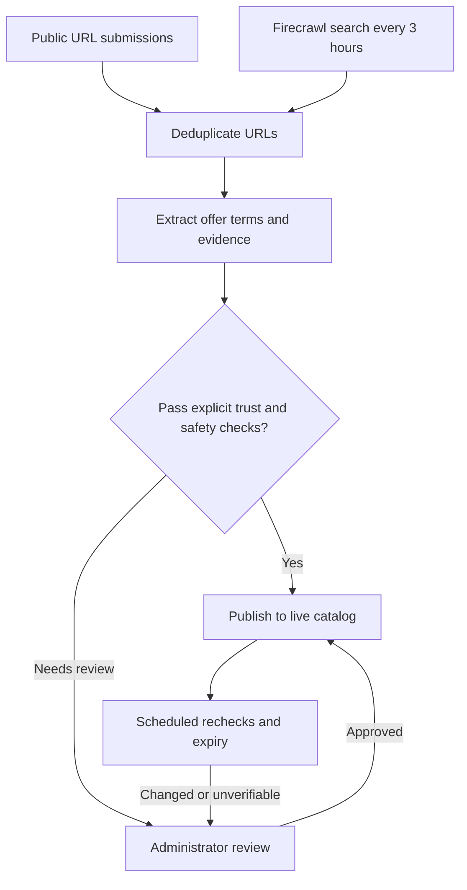

<p align="center"></p>
<h1 align="center">Perkdrop.click</h1>
<p align="center">Free tools, credits, and programs with eligibility, evidence, and original links.</p>
<p align="center"><a href="https://perkdrop-click.sanathr106.chatgpt.site">Visit Perkdrop</a></p>

## How it works



- Four search categories feed one intake pipeline.
- Matching offer keys merge to reduce duplicates.
- Untrusted sources and uncertain terms require review.
- Administrators can review up to 20 offers per batch.
- No domain is trusted by default. The public catalog contains no demo listings.

Discovery does not depend on the website or repository being public.

Finding an offer does not guarantee publication. It must pass automatic checks
or receive administrator approval. Successful searches can add pending
candidates while the public catalog remains empty.

Rechecks run in bounded batches every 12 hours. Changed or repeatedly
unverifiable offers are hidden pending review; expired offers leave the catalog.

## Tech stack

### How the services connect

- **Sites and Cloudflare Workers** host two versions of the same website,
  connected to one production backend.
- **Convex** stores submissions, candidates, review history, and published
  offers. It runs the discovery cron every three hours.
- **Firecrawl** searches public pages and extracts offer details. Convex then
  deduplicates, verifies, and routes candidates for publication or review.
- **Live queries** update the browser when approved offers change. No website
  redeployment is needed for new listings.

The admin queue uses the same backend. Server-authorized approval publishes an
offer; rejection keeps it out of the public catalog.

| Layer        | Tools                                               |
| ------------ | --------------------------------------------------- |
| Website      | React 19, TanStack Start, TypeScript, Vite          |
| UI           | Geist, Phosphor icons, CSS, generated WebP hero     |
| Backend      | Convex database, live queries, cron jobs, workflows |
| Discovery    | Firecrawl search and structured extraction          |
| Hosting      | Sites and Cloudflare Workers                        |
| Agent access | Browser-side WebMCP, where supported                |
| Checks       | Vitest, convex-test, GitHub Actions                 |

Provider favicons use the offer's HTTPS origin, with initials as fallback. Icons
do not establish trust.

## Try the reviewer demo

Open the
[reviewer demo](https://perkdrop-click.sanathr106.chatgpt.site/reviewer-demo).
You can also find it in the footer and admin sign-in page.

1. Open the page. No credential entry is needed.
2. Inspect one of three real discovery snapshots, clearly marked as unverified.
3. Enter a reason and approve or reject the demo copy.
4. Switch between pending, approved, and rejected views.
5. Reset or reload to start again.

`AllGas2026` is a public demo label, not a production administrator password.

Decisions stay in the current tab. They cannot publish offers, change Convex
data, trust sources, or trigger paid extraction. The real `/admin` route still
requires the private token.

## WebMCP support

Perkdrop supports the experimental
[WebMCP API](https://developer.chrome.com/docs/ai/webmcp/imperative-api) in
compatible browsers.

| Tool                   | What an agent can do                                 |
| ---------------------- | ---------------------------------------------------- |
| `perkdrop_navigate`    | Open the catalog, submission form, or reviewer demo. |
| `perkdrop_demo_list`   | Read this tab's demo offers and decisions.           |
| `perkdrop_demo_decide` | Approve or reject a demo copy with a review reason.  |
| `perkdrop_demo_reset`  | Reset this tab's demo decisions.                     |

The three demo tools are available only while the reviewer demo is open.

- Tools use the same decision validation as the visible buttons.
- Extracted offer text is marked as untrusted data.
- Production moderation and submission are not exposed as agent tools.
- Ordinary links and buttons work without WebMCP.

Registration uses `document.modelContext` with cleanup when components unmount.
No polyfill or external agent script is loaded.

This is browser-side WebMCP, not a remote MCP server. Support depends on the
browser and agent.

## Run locally

Use Node 22.22.3+ and pnpm 11.21.0.

```sh
pnpm install --frozen-lockfile
pnpm exec convex dev
```

Set `VITE_CONVEX_URL` in an ignored `.env.local` following
[.env.example](.env.example). In another terminal:

```sh
pnpm run dev
```

### Configuration

| Setting              | Where to configure it                                                    |
| -------------------- | ------------------------------------------------------------------------ |
| `VITE_CONVEX_URL`    | Local or production build environment. Public backend URL, not a secret. |
| `FIRECRAWL_API_KEY`  | Convex deployment secret.                                                |
| `ADMIN_REVIEW_TOKEN` | Convex deployment secret, at least 32 characters.                        |
| `DISCOVERY_ENABLED`  | Set to `true` in Convex to enable scheduled discovery.                   |

For production, supply your backend URL through the build environment or ignored
`.env.production.local`. It is embedded in browser assets.

Only the blank `.env.example` template belongs in Git. Deployment-specific
environment files are ignored.

Never prefix secrets with `VITE_` or commit them. The admin page keeps its token
in memory; the backend authorizes every administrative operation.

### When configuration changes

- **Firecrawl key:** new requests use the updated Convex secret. No redeployment
  needed.
- **Admin token:** reload `/admin` and sign in with the new token. No
  redeployment needed.
- **Frontend backend URL:** rebuild and redeploy the website.
- **Convex project defaults:** do not update existing deployments automatically.

See
[Convex environment variables](https://docs.convex.dev/production/environment-variables).

## Check and deploy

```sh
pnpm run check
pnpm run build
# Confirm the target deployment before changing the backend.
pnpm exec convex deploy
pnpm run deploy
```

Deploy backend changes first. Workers hosts the server-rendered app; forks must
use their own account configuration in [wrangler.jsonc](wrangler.jsonc).

- `pnpm run deploy` updates Cloudflare Workers only.
- Publish chatgpt.site through the Sites hosting workflow using
  [.openai/hosting.json](.openai/hosting.json).
- Forks must register their own Sites project and use their own Cloudflare
  account.

Routes live in [src/routes](src/routes); ingestion, moderation, discovery, and
lifecycle code live in [convex](convex). Tests sit beside the backend modules.

## Operational limits

- Discovery depends on Firecrawl availability and credits. Failed jobs and
  search history are visible in `/admin`.
- Anonymous feedback is deduplicated and rate-limited, not proof of one person
  or successful redemption. There is no visitor counter or email integration.
- Keep credentials private and rotate exposed keys. A passive audit cannot
  guarantee security.

## How Codex helped me build this

I started with the idea of collecting useful free offers in one place. I used
Codex to turn that into a working application, then refined it through
screenshots, browser checks, and direct feedback on what felt wrong.

- Built the catalog, offer details, submission form, and review queue.
- Refined mobile layouts from screenshots, including input spacing, checkboxes,
  and repeated navigation.
- Connected Firecrawl to Convex with scheduled search, deduplication, evidence
  extraction, and bounded retries.
- Added batch moderation, offer rechecks, and expiry handling.
- Wrote tests for authorization, duplicates, publication, feedback limits, and
  lifecycle changes.
- Converted the hero artwork to lossless WebP, reducing its size by about 45%.
- Added the isolated reviewer demo and WebMCP tools, then tested them in the
  browser.
- Set up hosting and GitHub Actions checks.

I set the product direction, reviewed the visual changes, and configured the
service credentials. Codex handled implementation and debugging across the same
repository, including the test runs and deployment checks used during each
revision.

## Hackathon and thanks

Built as part of the
[All Gas hackathon](https://www.convex.dev/hackathons/all-gas).

See [hackathon.md](hackathon.md) for the build log, submission requirements, and
remaining integration and hosting gaps.

Thank you to **Convex, OpenAI, Firecrawl, and AgentMail** for hosting and
sponsoring the event. Convex and Firecrawl power the app; OpenAI's Codex helped
build it. AgentMail is credited as a sponsor, not as an integration.
