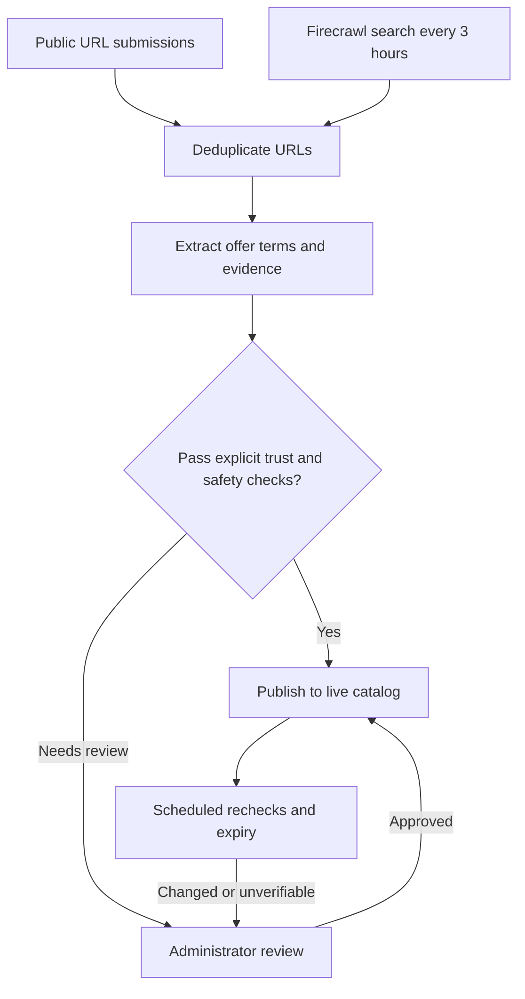

<p align="center"></p>
<h1 align="center">Perkdrop.click</h1>
<p align="center">Free tools, credits, and programs with eligibility, evidence, and original links.</p>
<p align="center"><a href="https://perkdrop-click.sanathr106.chatgpt.site">Visit Perkdrop</a></p>

## How it works



Four search categories feed the same intake pipeline. Repeated offer keys merge; uncertain terms and untrusted sources need review. Administrators can review up to 20 offers per batch. No domain is trusted by default, and production contains no demo listings.

Discovery runs independently of the website or repository being public. Finding an offer does not guarantee publication: it must pass the automatic checks or receive administrator approval. Successful searches can therefore add pending candidates while the public catalog remains empty.

Rechecks run in bounded batches every 12 hours. Changed or repeatedly unverifiable offers are hidden pending review; expired offers leave the catalog.

## Tech stack

The website runs in two deployments: Sites serves the public chatgpt.site URL, and Cloudflare Workers serves the workers.dev URL. Both connect to the same production Convex backend. Neither website host runs the discovery cron.

Convex stores submissions, discovery history, extracted candidates, review decisions, and published offers. Its scheduler starts Firecrawl searches every three hours. Firecrawl returns public URLs and extracts offer details; Convex handles deduplication, verification, retries, and publication. The browser subscribes to Convex queries, so approved offers appear without a website redeployment.

The administrator queue reads pending candidates from that same backend. Approval is checked on the server and publishes the offer; rejection keeps it out of the public catalog. A successful search does not mean an offer has been approved.

| Layer              | Tools                                                   |
| ------------------ | ------------------------------------------------------- |
| Website            | React 19, TanStack Start, TypeScript, Vite              |
| UI                 | Geist, Phosphor icons, CSS, generated WebP hero         |
| Backend            | Convex database, live queries, cron jobs, workflows     |
| Discovery          | Firecrawl search and structured extraction              |
| Hosting and checks | Cloudflare Workers, Vitest, convex-test, GitHub Actions |

Provider favicons use the offer's HTTPS origin, with initials as fallback. Icons do not establish trust.

## Reviewer demo and agent access

Open [/reviewer-demo](https://perkdrop-click.sanathr106.chatgpt.site/reviewer-demo), or choose **Try reviewer demo** in the footer or admin sign-in page. It opens immediately without typing credentials. `AllGas2026` is a public demo label, not a production administrator password.

The demo uses three dated copies of real discovered offers. It clearly labels extracted claims as unverified. Enter a review reason, approve or reject a copy, and switch between decision filters. Reset or reload to start again. Demo decisions live only in the current tab; they never publish offers, modify Convex, trust sources, or trigger paid extraction. The real `/admin` route still requires the private administrator token.

Browsers supporting the experimental [WebMCP API](https://developer.chrome.com/docs/ai/webmcp/imperative-api) can discover `perkdrop_navigate` for public navigation. The demo additionally exposes `perkdrop_demo_list`, `perkdrop_demo_decide`, and `perkdrop_demo_reset`. Tools use the same local decision validation as the buttons. External offer text is marked as untrusted data. No production moderation or submission tool is exposed.

WebMCP uses feature detection on `document.modelContext` and removes registrations when components unmount. No polyfill, external agent script, or new dependency is required. Unsupported browsers retain all ordinary controls. This is browser-side WebMCP, not a remotely accessible MCP server, and it does not guarantee that every judging agent supports the API.

## Run locally

Use Node 22.22.3+ and pnpm 11.21.0.

```sh
pnpm install --frozen-lockfile
pnpm exec convex dev
```

Set `VITE_CONVEX_URL` in an ignored `.env.local` following [.env.example](.env.example). In another terminal:

```sh
pnpm run dev
```

For a production build, set `VITE_CONVEX_URL` through the build environment or an ignored `.env.production.local` file. Use your own deployment URL. This address is public and is embedded in browser assets; it is not an authentication credential. Only the blank `.env.example` template belongs in Git. Deployment-specific `.env` files are ignored.

Set `FIRECRAWL_API_KEY` and `ADMIN_REVIEW_TOKEN` (at least 32 characters) in your **Convex deployment**, not the website Worker. Never prefix secrets with `VITE_` or commit them. The admin page holds its token only in memory; backend authorization protects administrative operations.

Updating these secrets in the deployment settings does not require redeployment. New Firecrawl requests use the updated key. After changing the admin token, reload `/admin` and sign in with the new token. Project defaults do not update existing deployments. Changing the frontend's `VITE_CONVEX_URL` requires rebuilding and deploying the website. See [Convex environment variables](https://docs.convex.dev/production/environment-variables).

## Check and deploy

```sh
pnpm run check
pnpm run build
# Confirm the target deployment before changing the backend.
pnpm exec convex deploy
pnpm run deploy
```

Deploy backend changes first. Workers hosts the server-rendered app; forks must use their own account configuration in [wrangler.jsonc](wrangler.jsonc).

The public hackathon deployment is hosted on chatgpt.site using Sites. The Cloudflare Workers deployment remains available. `pnpm run deploy` updates Cloudflare only; publish Sites through its hosting workflow using the project in [.openai/hosting.json](.openai/hosting.json). Forks must register their own Sites project.

Routes live in [src/routes](src/routes); ingestion, moderation, discovery, and lifecycle code live in [convex](convex). Tests sit beside the backend modules.

## Operational limits

- Discovery depends on Firecrawl availability and credits. Failed jobs and search history are visible in `/admin`.
- Anonymous feedback is deduplicated and rate-limited, not proof of one person or successful redemption. There is no visitor counter or email integration.
- Keep credentials private and rotate exposed keys. A passive audit cannot guarantee security.
- This repository is public for the hackathon. Verify hosting, sponsor integrations, video, and submission requirements before entering; building for the event does not mean it has been submitted.

## How Codex helped me build this

I started with the idea of collecting useful free offers in one place. I used Codex to turn that into a working application, then refined it through screenshots, browser checks, and direct feedback on what felt wrong.

- Built the catalog, offer details, submission form, and administrator queue with React and TanStack Start. After testing on mobile, we removed repeated browse links, fixed input and error spacing, aligned review checkboxes, and collapsed discovery logs.
- Connected Firecrawl to Convex with four searches every three hours, URL normalization, offer-key deduplication, bounded retries, and evidence extraction. Added batch moderation so uncertain offers wait for a decision instead of appearing as verified results.
- Added scheduled offer rechecks and expiry handling, plus tests for duplicate submissions, administrator authorization, publication, feedback limits, and offer lifecycle changes.
- Converted the generated hero artwork to lossless WebP, reducing its size by about 45%. Set up the Cloudflare deployment and GitHub Actions checks, then verified the deployed admin page at mobile and desktop widths.

I set the product direction, reviewed the visual changes, and configured the service credentials. Codex handled implementation and debugging across the same repository, including the test runs and deployment checks used during each revision.

## Hackathon and thanks

Built as part of the [All Gas hackathon](https://www.convex.dev/hackathons/all-gas).

See [hackathon.md](hackathon.md) for the build log, submission requirements, and remaining integration and hosting gaps.

Thank you to **Convex, OpenAI, Firecrawl, and AgentMail** for hosting and sponsoring the event. Convex and Firecrawl power the app; OpenAI's Codex helped build it. AgentMail is credited as a sponsor, not as an integration.
