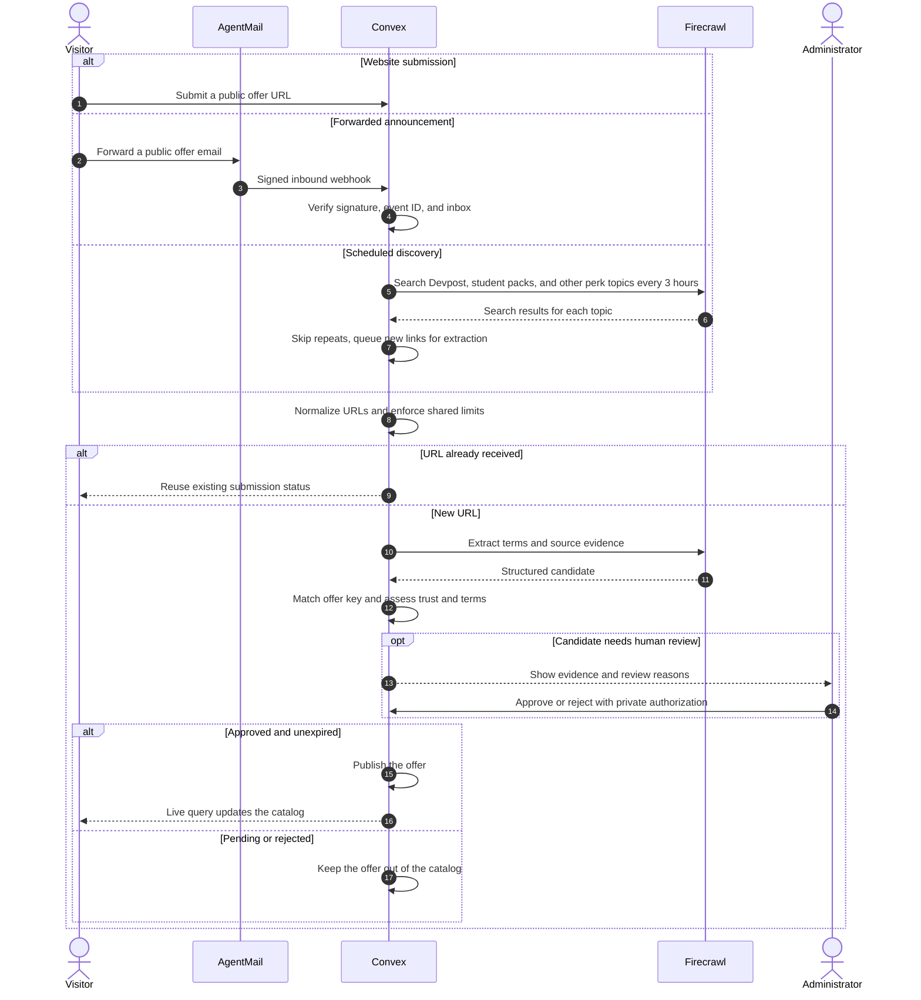

<p align="center"></p>
<h1 align="center">Perkdrop.click</h1>
<p align="center">Free tools, credits, and programs with eligibility, evidence, and original links.</p>
<p align="center"><a href="https://perkdrop-click.sanathr106.chatgpt.site">Visit Perkdrop</a></p>

See [AGENTS.md](AGENTS.md) for the code map and safe review instructions.

## How it works



Three intake paths share one queue: a public URL on `/submit`, a forwarded
email, or scheduled Firecrawl search. Matching offer keys merge duplicates. No
domain is trusted by default. Finding a link does not publish it.

Rechecks take up to 25 due offers every two hours. Changed or repeatedly unverifiable
offers leave the catalog pending review. Expired offers are removed.

## Tech stack

| Layer        | Tools                                               |
| ------------ | --------------------------------------------------- |
| Website      | React 19, TanStack Start, TypeScript, Vite          |
| Backend      | Convex database, live queries, cron jobs, workflows |
| Discovery    | Firecrawl search and structured extraction          |
| Email intake | AgentMail inbound webhooks and receipts             |
| Hosting      | ChatGPT Sites, plus a Cloudflare Workers copy       |
| Agent access | Browser-side WebMCP, where the browser supports it  |
| Checks       | Vitest, convex-test, GitHub Actions                 |

Convex holds submissions, candidates, review history, and published offers.
Firecrawl reads public pages. AgentMail accepts forwarded perk mail and sends a
receipt for the extracted links. Live queries update the catalog without a
website redeploy.

Provider logos use Simple Icons when the host is known, then the offer favicon,
then initials. Icons do not establish trust.

## Try the reviewer demo

Open
[the reviewer demo](https://perkdrop-click.sanathr106.chatgpt.site/reviewer-demo).
No credential is required.

The public label `AllGas2026` is a demo tag, not a production admin password.
Decisions stay in the current tab. They cannot publish offers or call Firecrawl.
The real `/admin` route still needs the private token.

## WebMCP

In browsers with
[WebMCP](https://developer.chrome.com/docs/ai/webmcp/imperative-api), agents can
call `perkdrop_navigate` on the public site. The demo-only tools
`perkdrop_demo_list`, `perkdrop_demo_decide`, and `perkdrop_demo_reset` register
only on `/reviewer-demo`. This is `document.modelContext`, not a remote MCP
server.

## Run locally

Node 22.22.3+ and pnpm 11.21.0.

```sh
pnpm install --frozen-lockfile
pnpm exec convex dev
```

Use [.env.example](.env.example) to add `VITE_CONVEX_URL` to the ignored
`.env.local` created by Convex. Preserve its deployment selector. In another terminal:

```sh
pnpm run dev
```

| Setting                    | Notes                                                             |
| -------------------------- | ----------------------------------------------------------------- |
| `VITE_CONVEX_URL`          | Public Convex client URL. Safe to embed in the website.           |
| `FIRECRAWL_API_KEY`        | Convex secret.                                                    |
| `ADMIN_REVIEW_TOKEN`       | Convex secret, at least 32 characters.                            |
| `DISCOVERY_ENABLED`        | Set `true` on Convex to run scheduled search.                     |
| `AGENTMAIL_API_KEY`        | Convex secret for receipts.                                       |
| `AGENTMAIL_WEBHOOK_SECRET` | Convex secret. Svix secret from AgentMail.                        |
| `AGENTMAIL_INTAKE_ADDRESS` | Public inbox shown on `/submit`.                                  |
| `PUBLIC_SITE_URL`          | HTTPS origin used in receipt links. Match the live app URL above. |
| `CONVEX_SITE_URL`          | Set by Convex. Receipts load `/brand/mark.png` from it.           |
| `AGENTMAIL_BASE_URL`       | Optional. Defaults to `https://api.agentmail.to/v0`.              |

Never prefix secrets with `VITE_`. Only `.env.example` belongs in Git.

Webhook path: `https://<deployment>.convex.site/agentmail/webhook` for
`message.received`. Restrict it to the configured inbox. Forward public
announcements only.

```sh
pnpm run check
pnpm run build
```

After confirming the target, deploy backend changes with `pnpm exec convex deploy`.
`pnpm run deploy` updates Cloudflare Workers only. Use the Sites publishing
workflow for chatgpt.site; [.openai/hosting.json](.openai/hosting.json) identifies
the existing project. Forks need their own Sites project and Workers account.

## How I built with Codex

I used Codex to build the React screens and Convex pipeline, then revised the
product through screenshots and browser sessions. My feedback drove the mobile
layout, simpler navigation, and separate administrator workspace.

Codex helped trace duplicate submissions and empty-feed states, add tests for
authorization and offer lifecycle changes, and verify releases on both hosts.
I chose the product direction and reviewed the results. See the evidence and
dated build log in [hackathon.md](hackathon.md).

## Hackathon and thanks

Built for the [All Gas hackathon](https://www.convex.dev/hackathons/all-gas).

See [hackathon.md](hackathon.md) for the build log and remaining submission
steps. See [AGENTS.md](AGENTS.md) for the file map and what is actually wired.

Thank you to Convex, OpenAI, Firecrawl, and AgentMail. Convex, Firecrawl, and
AgentMail run in the product. Codex helped build it. There is no OpenAI model
API call in the running app.
