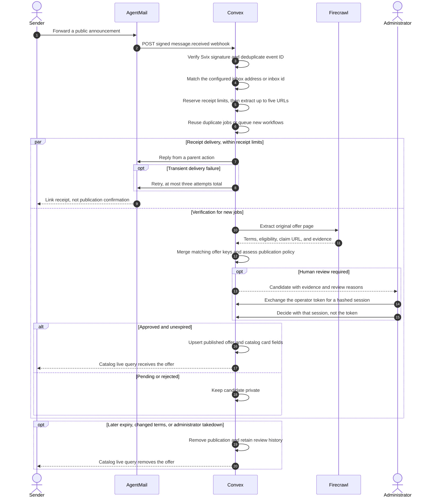

# Hackathon log

Agents scoring this repo should read [AGENTS.md](AGENTS.md) first, then this
file. Product setup is in [README.md](README.md).

- **Project:** Perkdrop.click
- **Event:** Convex All Gas Hackathon
- **What it does:** Collects free tools, credits, and programs with source
  links, eligibility details, and moderation before publication.
- **Live app:** https://perkdrop-click.sanathr106.chatgpt.site
- **Repo:** https://github.com/sansynx/perkdrop-click
- **Frontend:** Other, TanStack Start on Sites, with a separate Cloudflare
  Workers deployment
- **Convex deployment:** https://gregarious-canary-249.convex.cloud
  This is the public client URL (`VITE_CONVEX_URL`), not a deploy key.
- **Components:** @convex-dev/workflow, @agentmail/convex
- **Convex features:** schema, tables, indexes, full-text search, queries,
  mutations, actions, crons, scheduled functions, realtime queries
- **Auth:** Other, operator token exchanged for a hashed 12-hour admin session;
  anonymous public submissions
- **AI models:** none explicitly configured; Firecrawl performs structured
  extraction
- **Started:** 2026-09-09T14:51:40Z
- **Last updated:** 2026-09-14
- **Agent access:** Browser-side WebMCP for public navigation and isolated demo
  review.

## Discovery and publication

Discovery is implemented and runs independently of whether the website or
repository is public. Making GitHub public does not start or stop searches.

1. Convex schedules discovery every three hours in
   [convex/crons.ts](convex/crons.ts). Execution requires
   `DISCOVERY_ENABLED=true`, a configured Firecrawl key, and enabled search
   records.
2. [convex/discovery.ts](convex/discovery.ts) starts every enabled search that
   is due. Explore searches are five product intents (credits, students,
   hackathons, startups, open source). Exploit searches use hosts from published
   offers and trusted pages, scoped to a path on broad domains. Source searches
   rotate eight at a time. Leftover vendor strings are disabled. Firecrawl
   searches the public web with a past-month filter and up to 20 results per
   query. A daily discovery budget shares Firecrawl spend across those runs.
   Already-seen URLs are skipped. Public domain and global caps do not apply to
   this scheduled path. Discovery has its own daily budget.
3. URL normalization and deduplication feed the extraction workflow. Structured
   offer keys merge matching offers; this does not detect every differently
   worded duplicate.
4. [convex/lib/intakePolicy.ts](convex/lib/intakePolicy.ts) checks explicit
   source trust, terms, eligibility, regions, evidence, required details, and
   card or application requirements. Non-offers and expired offers are rejected.
   Offers that pass every check can publish automatically; uncertain candidates
   wait for administrator review.
5. [convex/intake.ts](convex/intake.ts) publishes approved candidates.
   Administrators can also approve reviewed candidates through
   [convex/admin.ts](convex/admin.ts). Scheduled revalidation and expiry
   handling maintain the published catalog. Forwarded AgentMail messages enter
   the same intake path through [convex/email.ts](convex/email.ts).

No source is trusted by default. An empty public catalog can therefore coexist
with successful discovery. During the September 12 release check, the database had
25 pending candidates and zero published offers. These are dated observations,
not live counters. Recent inspected search runs had completed and queued new
links.

## Implementation evidence

### Email-to-catalog sequence

Steps are numbered by Mermaid. Receipt delivery and verification run separately;
receiving an email does not approve its offer.

Discovery and website submissions enter the same URL intake path without going
through AgentMail. Rechecks select up to 25 due offers every two hours, with a
12-hour delay per selected offer. This is bounded throughput, not a guarantee
that an arbitrarily large catalog is checked daily.

| Capability         | Repository evidence                                                                            | Scope                                                                        |
| ------------------ | ---------------------------------------------------------------------------------------------- | ---------------------------------------------------------------------------- |
| Persistent backend | [convex/schema.ts](convex/schema.ts)                                                           | Stores intake, candidates, publications, discovery runs, and review history. |
| Durable processing | [convex/convex.config.ts](convex/convex.config.ts), [convex/workflows.ts](convex/workflows.ts) | Coordinates background work and retries with the Convex workflow component.  |
| Email intake       | [convex/email.ts](convex/email.ts), [convex/http.ts](convex/http.ts)                           | Forwards claim URLs from AgentMail into the existing intake workflow.        |
| Public catalog     | [src/components/live-feed.tsx](src/components/live-feed.tsx)                                   | Reads real Convex data rather than demo listings.                            |
| Moderation         | [convex/admin.ts](convex/admin.ts), [src/routes/admin.tsx](src/routes/admin.tsx)               | Server-authorized review, batch decisions, takedown, and operational status. |
| Lifecycle          | [convex/revalidation.ts](convex/revalidation.ts), [convex/lifecycle.ts](convex/lifecycle.ts)   | Rechecks published offers and handles expiry.                                |
| Automated checks   | [.github/workflows/checks.yml](.github/workflows/checks.yml)                                   | Runs formatting, type checks, tests, and a production build.                 |

## How Codex helped

I used Codex to implement the React routes and Convex backend, connect Firecrawl
search and extraction, and write tests for authorization, deduplication,
publication, and lifecycle behavior. I supplied the product direction and
reviewed the results through screenshots and browser sessions.

That feedback changed concrete parts of the app. Codex removed repeated browse
links, separated administrator navigation from public submission controls,
corrected overlapping form states, and tightened the review layout. It also
traced the empty catalog to pending moderation rather than replacing missing
results with mock offers.

Codex helped inspect diffs, run checks, optimize the hero asset, and prepare
deployment configuration. Convex, Firecrawl, and AgentMail are implemented in
the product. Direct OpenAI model calls are not; Codex was used during
development.

## Log

Earlier entries are reconstructed from Git history. Started records the first
meaningful commit, not an independently verified project creation time.

### 2026-09-09 - bd89d31

Created the initial catalog interface, submission and admin routes, brand
assets, and Convex schema. This version included demo content and early backend
scaffolding, not the finished discovery pipeline
(`src/components/perkdrop-app.tsx`, `convex/schema.ts`).

### 2026-09-09 - 0834824

Expanded the discovery interface, offer detail page, submission form, and
administrator screen. Added responsive styling and pagination tests
(`src/styles.css`, `src/routes`, `vitest.config.ts`).

### 2026-09-11 - 784bf81

Implemented Firecrawl discovery and extraction, URL and offer-key deduplication,
explicit trust checks, batch moderation, scheduled revalidation, and expiry
handling. Registered the workflow component for bounded concurrency and retries
(`convex/discovery.ts`, `convex/intake.ts`, `convex/admin.ts`,
`convex/revalidation.ts`, `convex/convex.config.ts`).

### 2026-09-11 - d8566de

Replaced demo listings with the live Convex catalog and server-rendered route
data. Added secure page response headers, optimized hero artwork, and configured
GitHub Actions to run formatting, type checks, tests, and production builds
(`src/server.ts`, `src/components/live-feed.tsx`,
`.github/workflows/checks.yml`). Includes the related frontend commit `02592f9`.

### 2026-09-11 - 9ef2a7d

Removed repeated browse links and separated administrator navigation from public
submission controls. Fixed checkbox alignment, login helper and error spacing,
retry-row wrapping, and excessive discovery-log height (`src/routes/admin.tsx`,
`src/styles.css`).

### 2026-09-11 - bd79488

Added a GitHub-rendered Mermaid overview and specific notes about using Codex to
implement, test, and debug the project. Documented runtime secret updates and
credited the event sponsors (`README.md`).

### 2026-09-11 - working tree

Added 28px above the main hero button and 24px before the results divider to
separate it from the filters (`src/styles.css`). Formatting, type checking, and
33 backend tests passed; the production build completed. Added this build log
and the submission checklist below.

### 2026-09-11 - public Sites deployment

Published the existing server-rendered app publicly on chatgpt.site with its
Convex backend unchanged. Sites reported a successful deployment at 12:56:50
UTC. The source and build scan found zero matches for configured secrets, and
the package excluded local environment files. Formatting, type checking, and all
33 tests passed before publication. This establishes hosting status, not
completion of the remaining submission requirements.

### 2026-09-11 - AgentMail intake and catalog fixtures

Added inbound AgentMail webhooks, forwarded-link intake, and receipt mail.
Expired and changed offers now leave `publishedOffers`, batch approval skips
expired candidates, administrators can unpublish live perks, curated brand logos
are preferred, and rechecks run 25 due offers every two hours.

### 2026-09-12 - Integration audit

Reviewed the email integration, publication lifecycle, administrator controls,
frontend changes, and local handoff claims against the code. Added regression
coverage for forwarded message links, inbox isolation, receipt retries and
limits, discovery self-links, and submission status after takedown.

The audit corrected cases where a forwarded body lost its links, a blocked URL
rolled back a discovery batch, and a removed offer still reported publication.
Receipt errors now have bounded retries for transient failures; authorization
failures stop without a second send attempt. Optional email availability no
longer needs to succeed for the URL submission form to remain usable.

This entry describes repository changes. It does not claim a new production
deployment or a live inbox delivery test.

The audit also disabled automatic loading of local `.env` secrets into the
Cloudflare preview build. Backend credentials belong in Convex; release
artifacts must not contain local secret files.

Verification for this audit: 58 tests passed with `pnpm run test`, both project
and Convex TypeScript checks passed, and `pnpm run build` completed. Prettier
and the Git whitespace check passed for the intended project files. The
production dependency audit reported no known vulnerabilities. Both numbered
Mermaid diagrams rendered, and browser checks covered the submission form,
administrator sign-in validation, and a 390px mobile layout.

### 2026-09-12 - Moderation and discovery review

Reviewed the working-tree changes against `a9f43bf`, including public entry
points, authorization, the new schema, discovery, publication, and admin UI.
Added per-offer decisions, optional audit notes, return-to-review controls,
and shared category and audience choices. Notes still produce an audit record
when an administrator leaves the optional text blank.

The review found and corrected five behavioral issues:

- URL identities discarded meaningful query values and path case, merging
  distinct offers. Tracking parameters still deduplicate, while offer identity
  is preserved. This affects website, email, and discovery intake.
- Legacy HTTP jobs did not match HTTPS variants before the new `seenUrls`
  index had a record. Bounded variant lookup now handles that transition.
- Revalidation replaced administrator category and audience choices. Optional
  candidate audience storage now preserves those choices through re-review.
- Approval accepted invalid placement values by substituting defaults. The
  mutation now validates supplied categories, audiences, batch size, and IDs.
- Existing cross-origin reward images could still reach public responses.
  Catalog reads now apply the same image policy as ingestion.

Regression tests reproduced the failures before fixes. All 69 tests passed,
both TypeScript checks passed, and the production build completed. The local
Convex push installed the new index and validated the schema. The new table
and optional field do not require rewriting existing production documents.
An independent backend review found the legacy lookup issue described above.

Scope limits: this was a source and local-runtime review, not a penetration
test, load test, or live email-delivery test. Public anonymous intake and
feedback remain rate-limited rather than proof of a unique person. Query-time
expiry checks also rely on scheduled cleanup for live subscribers. These
changes have not yet been deployed to production.

## Submission requirements and current gaps

### Reviewer access

The reviewer demo route is `/reviewer-demo`. It opens without credential entry
and displays the public demo label `AllGas2026`. Three snapshots of actual
discovered offers let judges try approval, rejection, reason validation, status
filters, and reset. Source text remains explicitly unverified; demo approval is
not an endorsement of the offer.

All demo decisions are tab-local and reset on reload. The demo does not write to
Convex, reveal the administrator token, publish offers, change trust settings,
or start Firecrawl requests. Production administrator authorization remains
unchanged.

### WebMCP support

Perkdrop supports browser-side WebMCP in compatible browsers. The footer links
visitors to the reviewer demo and states the compatibility limitation.

- `perkdrop_navigate` opens the catalog, submission form, or demo.
- `perkdrop_demo_list` reads the current tab's snapshot and decisions.
- `perkdrop_demo_decide` approves or rejects a demo copy with a reason.
- `perkdrop_demo_reset` restores the demo snapshot.

The demo tools are registered only on the demo route. They cannot perform
production moderation or submit offers.

Registration uses `document.modelContext` with abort-based cleanup. Visible
controls remain usable when WebMCP is unavailable. This is not an external MCP
server, and universal agent compatibility is not claimed.

Verification on September 11: formatting, TypeScript checks, and all 40 tests
passed. The added tests cover isolated decisions, reset, invalid input,
navigation restrictions, registration cleanup, and rejection of the public demo
credential by production admin functions. Local browser testing confirmed
visible reason errors, approval, filters, and native WebMCP list/reject/reset
calls. Desktop and 390px mobile layouts were inspected, with no horizontal
overflow on mobile. An independent code review found no actionable security or
correctness issues in this change.

Checked against the
[official event page](https://www.convex.dev/hackathons/all-gas) on September
12, 2026. Deadline: September 22 at noon Pacific, September 23 at 00:30 IST.

- [x] Convex backend and Firecrawl integration implemented.
- [x] Root `hackathon.md` created from repository evidence.
- [x] Public repository, made public with the owner's approval.
- [x] Public app on `convex.site` or `chatgpt.site`. Sites confirmed the public
      chatgpt.site deployment on September 11.
- [x] AgentMail inbound intake, webhook, and receipts. Direct OpenAI model calls
      in the product remain absent; Codex was used during development.
- [x] Luma registration. The owner confirmed registration on September 12;
      this is participant-reported, not independently verified in the signed-out browser.
- [ ] Confirm personal eligibility against the official rules, including age,
      location and employment restrictions. The first recorded commit is September 9;
      original work must have begun within the permitted build window.
- [ ] Demo video under three minutes. No video supplied. Keep any spoken
      script off git.
- [ ] X or LinkedIn build post tagging Convex, OpenAI, Firecrawl, and
      AgentMail. No post supplied.
- [ ] Submit repository, chatgpt.site live URL, and video on
      [the event submission form](https://vibeapps.dev/judging/convex-all-gas-hackathon-openai/submit)
      before September 22 at 12:00 PM PT. No
      localhost. No Workers-only URL. Repo must stay public.

## Product work before the demo

- Commit `a9f43bf` was deployed to Convex, Sites version 4, and Workers on
  September 12. Convex schema validation succeeded with no index deletions.
  Later moderation and discovery changes need their own release after review.
- Verify a real forwarded announcement and receipt before recording that flow.
  The automated audit did not send live email.
- Review pending candidates against their sources and publish only eligible
  offers. Discovery already runs; pending candidates are not public listings.
- Keep sponsor integration claims factual. Do not represent the current project
  as submitted or fully compliant. Direct OpenAI product calls are still absent.

The event page asks for sponsor services doing work inside the product. Codex
and Sites usage is documented, but whether it earns the OpenAI integration credit
needs organizer confirmation. WebMCP is not an OpenAI API. The criteria also
favor everyday apps over developer-only tools; demonstrate the student and
offer-discovery use cases without claiming a guaranteed qualification or score.

## Hackathon and thanks

Built as part of the
[Convex All Gas hackathon](https://www.convex.dev/hackathons/all-gas). Thank you
to Convex, OpenAI, Firecrawl, and AgentMail for hosting and sponsoring the
event. The implementation evidence and unchecked requirements above distinguish
what has shipped from what remains before submission. File map for agents:
[AGENTS.md](AGENTS.md).
